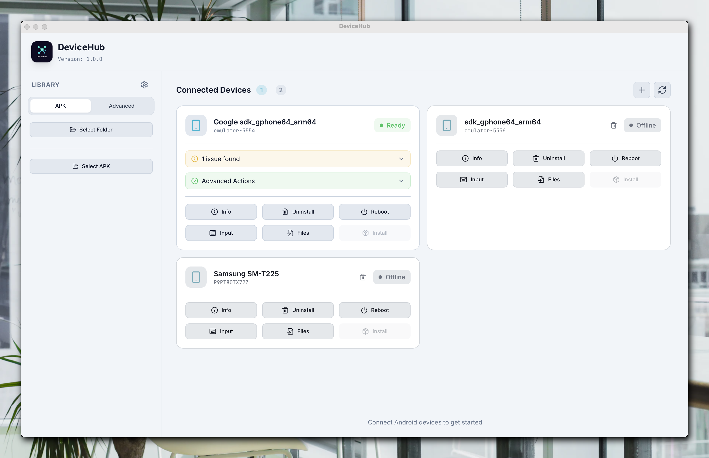

# DeviceHub

A modern, cross-platform Android device management tool.

  

---

## Features

- **Auto-detect devices** - Plug in your phone and it appears automatically
- **Requirement checklist** - Shows what settings you need to enable
- **Easy APK install** - Drag & drop or browse to install apps
- **Multi-device support** - Manage multiple phones at once
- **Wireless ADB** - Connect over WiFi without USB cable
- **Device tools** - Reboot, input text, file transfer, and more
- **Screen capture** - Screenshot and screen recording
- **AI Log Analysis** - Analyze logs with OpenAI, Claude, or Gemini
- **Multi-language** - English, Vietnamese, French

---

## Download

Download the latest version from the [Releases](https://github.com/user/adb-compass/releases) page:

| Platform | Installer            | Portable      |
| -------- | -------------------- | ------------- |
| Windows  | `.exe` or `.msi` | `.zip`      |
| macOS    | `.dmg`             | -             |
| Linux    | `.deb`             | `.AppImage` |

---

## Quick Start

1. **Enable Developer Options** on your phone

   - Go to Settings > About Phone > Tap "Build Number" 7 times
2. **Enable USB Debugging**

   - Go to Settings > Developer Options > Enable "USB Debugging"
3. **Connect your phone** via USB cable
4. **Accept the prompt** on your phone to allow USB debugging
5. **Install your APK** - Select the file and click Install!

---

## Troubleshooting

### Device not showing up?

- Try unplugging and reconnecting the USB cable
- Make sure USB Debugging is enabled
- Accept the "Allow USB debugging?" prompt on your phone

### Installation failed?

- Check the error message - usually it tells you what's wrong
- Make sure you have enough storage space
- Try uninstalling the existing app first

---

## Documentation

| Document                         | Description                                                  |
| -------------------------------- | ------------------------------------------------------------ |
| [Feature Roadmap](docs/FEATURES.md) | All features — implemented, in progress, and planned        |
| [Design System](docs/DESIGN.md)     | Colors, typography, spacing, components, and UI architecture |

---

## License

MIT License - Free to use and modify.
